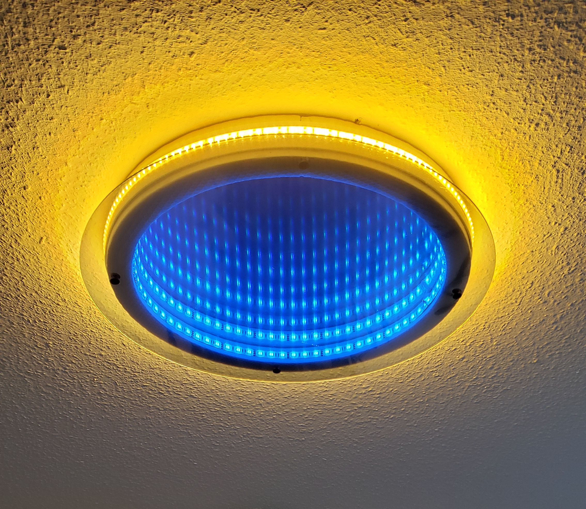

# arduino cyberlight

 

## RGBW Lichtsteuerung für Arduino nano
- Farbcode Einstellung nach Uhrzeit von batteriegepufferter Echtzeituhr PFC8563
- Fade in nach Einschalten

## Material
- Spiegel d=40cm
- Acrylglasplatte d=50cm
- Tönfolie
- XPS Schaumstoffplatte d=43cm x 5cm
- ca. 1m RGB LED streifen
- ca. 1m Weisslicht LED Streifen
- Arduino nano board
- PCF8563 Echtzeituhr board
- 4x MOSFET IRLML6344TRPBF
- 8x Widerstand 3k3 Ohm 
- Trafo 12V

## Aufbau
+12V - LED Streifen - MOSFET Drain
GND - MOSFET Source
Arduino Pins 3, 9, 10, 11 - R3k3 - MOSFET Gate - R3k3 - GND
PCF8563 SCL - A5, SDA - A4

